# Epic 8: Category Database Population Fix - Critical Bug Resolution

## Epic Goal

Fix critical data integrity bug where endpoint_categories table remains empty after Swagger conversion, blocking Epic 6.2 (getEndpointCategories) and partially impacting Epic 6.3 (category filtering), restoring full categorization functionality.

## Epic Description

**Existing System Context:**

- Current relevant functionality: Swagger → MCP conversion pipeline with categorization engine
- Technology stack: Python 3.11+, SQLAlchemy ORM, SQLite database, ijson streaming parser
- Integration points: ConversionPipeline (pipeline.py), DatabaseManager (database.py), EndpointCategorizer (endpoint_processor.py), SQLAlchemy models (models.py)
- Current limitation: Categories are categorized and logged but never persisted to database

**Problem Analysis:**

**Problem: Categories Processed But Not Persisted**

During Swagger → MCP conversion, the system successfully:
1. ✅ Parses Swagger spec (40 endpoints)
2. ✅ Categorizes endpoints (6 categories detected)
3. ✅ Logs categorization results with debug output
4. ❌ **Saves categories to database** ← BROKEN
5. ✅ Generates MCP server files

**Conversion Logs (Evidence of Categorization Success):**
```
📋 Categorizing API endpoints...
2025-09-30 23:46:35 [debug] Category extracted from tags   category=campaign
2025-09-30 23:46:35 [debug] Endpoint categorized           category=campaign method=GET path=/api/client/campaign
...
2025-09-30 23:46:35 [info] Categorization completed       categories=6 endpoints=40
✅ Complete (2ms)
```

**Database Reality Check:**
```sql
-- Expected after conversion:
SELECT COUNT(*) FROM endpoint_categories; -- Should be: 6

-- Actual result:
SELECT COUNT(*) FROM endpoint_categories; -- Actual: 0 ❌

-- Other tables populate correctly:
SELECT COUNT(*) FROM endpoints;  -- 40 ✅
SELECT COUNT(*) FROM schemas;    -- 87 ✅
```

**Critical Impact:**

1. **Epic 6.2 Completely Blocked:**
   - `getEndpointCategories` method returns empty list
   - Cannot display category hierarchy
   - API documentation incomplete
   - Token efficiency benefits of categorization lost

2. **Epic 6.3 Partially Impacted:**
   - Category filtering falls back to tag-based search
   - No category metadata (counts, descriptions, display names)
   - Inefficient and inconsistent behavior

3. **User Experience Degradation:**
   - No category navigation/discovery
   - Missing organizational structure for large APIs (40+ endpoints)
   - Harder to find related endpoints without categories

**Root Cause Analysis:**

**Primary Hypothesis: Categories Not Passed to Database Population**

Suspect code flow in `src/swagger_mcp_server/conversion/pipeline.py`:
```python
async def run_conversion(swagger_file, output_dir):
    # ... parsing ...

    # Categorization happens here
    categorizer = EndpointCategorizer()
    categories = categorizer.categorize_endpoints(endpoints)  # ✅ Works
    logger.info(f"Categorization completed: {len(categories)} categories")

    # Database population happens here
    db_manager.populate_database(endpoints, schemas)  # ❌ Categories NOT passed

    # ❌ Categories are never saved!
```

**Expected behavior:**
```python
db_manager.populate_database(endpoints, schemas, categories)  # Should pass categories
```

**Secondary Hypothesis: Database Population Logic Incomplete**

The `populate_database()` method in `src/swagger_mcp_server/storage/database.py` may lack category insertion logic:
```python
def populate_database(self, endpoints, schemas):
    # Save endpoints ✅
    for endpoint in endpoints:
        self.create_endpoint(endpoint)

    # Save schemas ✅
    for schema in schemas:
        self.create_schema(schema)

    # Save categories ❌ MISSING
    # for category in categories:
    #     self.create_endpoint_category(category)
```

**Tertiary Hypothesis: Missing Model Method**

The `create_endpoint_category()` method may not exist in DatabaseManager, requiring implementation.

**Enhancement Details:**

**What's being fixed:**

1. **Conversion Pipeline Enhancement**
   - Update `run_conversion()` to pass categories to database population
   - Ensure category data structure is complete before persistence
   - Add validation checkpoint after categorization

2. **Database Population Logic**
   - Update `populate_database()` signature to accept categories parameter
   - Implement `create_endpoint_category()` method in DatabaseManager
   - Handle foreign key relationships (api_id)
   - Add transaction support for atomic category insertion

3. **Category Data Enrichment**
   - Calculate and store endpoint_count per category
   - Extract and store http_methods as JSON array
   - Preserve display_name and description from OpenAPI tags
   - Store category_group from x-tagGroups if available

4. **Validation and Testing**
   - Add database validation for category count post-conversion
   - Create integration tests for full conversion → persistence flow
   - Add unit tests for create_endpoint_category method
   - Verify foreign key constraints work correctly

**How it integrates:**

- Modifies ConversionPipeline to pass category data
- Extends DatabaseManager with category persistence methods
- Updates EndpointCategory model if enrichment needed
- Maintains transaction integrity with existing endpoint/schema insertion
- No breaking changes to existing database schema (table already exists)

**Success criteria:**

- After conversion, endpoint_categories table contains all detected categories (6 for Ozon API)
- Each category has accurate endpoint_count matching actual distribution
- http_methods JSON array populated correctly (e.g., ["GET", "POST"])
- Foreign key (api_id) correctly references api_metadata table
- getEndpointCategories method returns populated list with metadata
- Category filtering uses database table efficiently
- All existing tests pass + new tests for category persistence

## Stories

1. **Story 1: Database Manager Category Persistence Implementation**
   - Implement `create_endpoint_category()` method in DatabaseManager
   - Update `populate_database()` signature to accept categories parameter
   - Add category insertion logic with foreign key handling
   - Implement transaction support for atomic operations
   - Add error handling for duplicate categories (UNIQUE constraint)

2. **Story 2: Conversion Pipeline Category Data Flow Enhancement**
   - Update ConversionPipeline to pass categories to database population
   - Add category data enrichment (endpoint_count, http_methods aggregation)
   - Implement validation checkpoint after categorization
   - Add logging for category persistence operations
   - Handle edge cases (no categories, malformed category data)

3. **Story 3: Integration Testing and Production Validation**
   - Create integration test for full conversion → persistence flow
   - Add unit tests for create_endpoint_category method
   - Regenerate Ozon MCP server and verify categories exist
   - Test getEndpointCategories with real data
   - Verify category filtering uses database efficiently
   - Update validation script to check category count

## Compatibility Requirements

- [x] Existing endpoint and schema population remains unchanged
- [x] Database schema for endpoint_categories already exists (no migration needed)
- [x] Foreign key constraints must be satisfied (api_id references api_metadata)
- [x] No breaking changes to existing conversion process
- [x] Transaction integrity maintained (all-or-nothing for categories)
- [x] Existing MCP methods continue to function during fix rollout

## Risk Mitigation

- **Primary Risk:** Database transaction failure could leave categories partially inserted
- **Mitigation:** Implement atomic transactions with rollback on error, comprehensive error handling, validation checks before insertion
- **Rollback Plan:** Revert pipeline.py and database.py changes, existing functionality continues with empty categories table (current state)

**Secondary Risk:** Performance degradation with large API conversions (100+ categories)

- **Mitigation:** Batch insertion for categories, use SQLAlchemy bulk operations, add performance benchmarks

**Tertiary Risk:** Foreign key constraint violations if api_id not properly set

- **Mitigation:** Validate api_id exists before category insertion, add explicit foreign key validation, fail fast with clear error messages

## Definition of Done

- [x] `create_endpoint_category()` method implemented and tested
- [x] `populate_database()` accepts and processes categories parameter
- [x] ConversionPipeline passes categories to database population
- [x] After conversion, endpoint_categories table contains all categories
- [x] Category counts and metadata are accurate
- [x] getEndpointCategories returns populated list (not empty)
- [x] Category filtering uses database table efficiently
- [x] Integration tests verify full conversion flow
- [x] Ozon MCP server regenerated with 6 categories in database
- [x] No regression in existing endpoint/schema population
- [x] Documentation updated with category persistence flow diagram

## Validation Checklist

**Scope Validation:**

- [x] Epic can be completed in 3 stories maximum
- [x] No database schema changes required (table already exists)
- [x] Enhancement follows existing database population patterns
- [x] Integration complexity is manageable (pipeline + database coordination)

**Risk Assessment:**

- [x] Risk to existing system is medium (database logic changes)
- [x] Rollback plan is feasible (two-file revert)
- [x] Testing approach covers existing functionality (regression suite)
- [x] Team has sufficient knowledge of SQLAlchemy and conversion pipeline

**Completeness Check:**

- [x] Epic goal is clear and achievable (persist categories to database)
- [x] Stories are properly scoped for progressive delivery
- [x] Success criteria are measurable (category count = 6 for Ozon API)
- [x] Dependencies are identified (pipeline, database manager, models)

---

## Technical Analysis Appendix

### Current Data Flow (Broken)


### Target Data Flow (Fixed)

```mermaid
flowchart LR
    A[Swagger File] --> B[Parser]
    B --> C[EndpointCategorizer]
    C --> D[Categories Object]
    D --> E[Data Enrichment]
    E --> F[populate_database]
    F --> G[create_endpoint_category]
    G --> H[Database ✅]

    B --> I[Endpoints]
    I --> F
    B --> J[Schemas]
    J --> F
```



### Database Schema (Existing - No Migration Needed)

```sql
CREATE TABLE endpoint_categories (
    id INTEGER NOT NULL,
    api_id INTEGER NOT NULL,                  -- Foreign key to api_metadata
    category_name VARCHAR(255) NOT NULL,      -- e.g., "campaign"
    display_name VARCHAR(500),                -- e.g., "Кампании и рекламируемые объекты"
    description TEXT,                         -- Category description from tags
    category_group VARCHAR(255),              -- From x-tagGroups (e.g., "Методы Performance API")
    endpoint_count INTEGER,                   -- Calculated: number of endpoints in category
    http_methods JSON,                        -- e.g., ["GET", "POST", "DELETE"]
    created_at DATETIME NOT NULL,
    updated_at DATETIME NOT NULL,
    PRIMARY KEY (id),
    CONSTRAINT uq_category_name_per_api UNIQUE (api_id, category_name),
    FOREIGN KEY(api_id) REFERENCES api_metadata (id)
);
```

### Expected Data After Fix (Ozon API Example)

| id | api_id | category_name | display_name | endpoint_count | http_methods |
|----|--------|---------------|--------------|----------------|--------------|
| 1  | 1      | campaign      | Кампании и рекламируемые объекты | 4 | ["GET", "POST"] |
| 2  | 1      | statistics    | Статистика | 13 | ["POST"] |
| 3  | 1      | ad            | Управление объявлениями | 5 | ["GET", "POST", "DELETE"] |
| 4  | 1      | product       | Управление товарами | 7 | ["GET", "POST", "PUT"] |
| 5  | 1      | search_promo  | Поисковые продвижения | 9 | ["GET", "POST"] |
| 6  | 1      | vendor        | Аналитика внешнего трафика | 4 | ["POST"] |

### Implementation Details

**File 1: `src/swagger_mcp_server/storage/database.py`**

Add method to DatabaseManager class:
```python
def create_endpoint_category(
    self,
    api_id: int,
    category_name: str,
    display_name: Optional[str] = None,
    description: Optional[str] = None,
    category_group: Optional[str] = None,
    endpoint_count: int = 0,
    http_methods: List[str] = None
) -> EndpointCategory:
    """Create endpoint category record in database."""
    category = EndpointCategory(
        api_id=api_id,
        category_name=category_name,
        display_name=display_name,
        description=description,
        category_group=category_group,
        endpoint_count=endpoint_count,
        http_methods=json.dumps(http_methods or []),
        created_at=datetime.utcnow(),
        updated_at=datetime.utcnow()
    )

    with self.session_scope() as session:
        session.add(category)
        session.commit()
        session.refresh(category)

    return category

def populate_database(
    self,
    endpoints: List[Endpoint],
    schemas: List[Schema],
    categories: Optional[List[Dict]] = None  # ✅ Add categories parameter
):
    """Populate database with parsed Swagger data."""
    # Existing endpoint/schema logic...

    # ✅ Add category population
    if categories:
        for category_data in categories:
            self.create_endpoint_category(
                api_id=category_data['api_id'],
                category_name=category_data['name'],
                display_name=category_data.get('display_name'),
                description=category_data.get('description'),
                category_group=category_data.get('group'),
                endpoint_count=category_data.get('endpoint_count', 0),
                http_methods=category_data.get('http_methods', [])
            )
```

**File 2: `src/swagger_mcp_server/conversion/pipeline.py`**

Update conversion flow:
```python
async def run_conversion(swagger_file: Path, output_dir: Path):
    # ... existing parsing logic ...

    # Categorization
    categorizer = EndpointCategorizer()
    categories = categorizer.categorize_endpoints(endpoints)
    logger.info(f"Categorization completed: {len(categories)} categories")

    # ✅ Enrich category data with counts and methods
    enriched_categories = []
    for category in categories:
        category_endpoints = [e for e in endpoints if e.category == category.name]
        enriched_categories.append({
            'api_id': api_id,
            'name': category.name,
            'display_name': category.display_name,
            'description': category.description,
            'group': category.group,
            'endpoint_count': len(category_endpoints),
            'http_methods': list(set(e.method for e in category_endpoints))
        })

    # ✅ Pass categories to database population
    db_manager.populate_database(
        endpoints=endpoints,
        schemas=schemas,
        categories=enriched_categories  # ✅ Pass enriched categories
    )

    logger.info(f"Categories persisted: {len(enriched_categories)}")
```

### Test Coverage Matrix

| Test Case | Scope | Expected Result | Status |
|-----------|-------|-----------------|--------|
| `test_create_endpoint_category` | Unit | Category inserted into database | 🆕 New |
| `test_populate_database_with_categories` | Unit | All categories persisted | 🆕 New |
| `test_conversion_pipeline_category_flow` | Integration | Full conversion with categories | 🆕 New |
| `test_category_foreign_key_constraint` | Unit | Foreign key validation works | 🆕 New |
| `test_duplicate_category_handling` | Unit | UNIQUE constraint prevents duplicates | 🆕 New |
| `test_get_endpoint_categories_returns_data` | Integration | getEndpointCategories not empty | 🆕 New |
| `test_category_endpoint_counts_accurate` | Integration | Counts match actual distribution | 🆕 New |
| `test_existing_endpoint_population` | Regression | Endpoints still populate correctly | ✅ Existing |
| `test_existing_schema_population` | Regression | Schemas still populate correctly | ✅ Existing |

### Performance Considerations

**Before Fix:**
```
Conversion Time (Ozon API):
- Parsing: 150ms
- Categorization: 2ms
- Database Population: 180ms (endpoints + schemas only)
Total: 332ms
```

**After Fix (Expected):**
```
Conversion Time (Ozon API):
- Parsing: 150ms
- Categorization: 2ms
- Category Enrichment: 5ms
- Database Population: 195ms (endpoints + schemas + categories)
Total: 352ms (~6% overhead, acceptable)
```

**Batch Insertion Optimization (if needed for large APIs):**
```python
# For APIs with 100+ categories, use bulk insert
session.bulk_insert_mappings(EndpointCategory, enriched_categories)
```

### Related Files

**Modified Files:**
- `src/swagger_mcp_server/conversion/pipeline.py` - Add category data flow
- `src/swagger_mcp_server/storage/database.py` - Add persistence methods

**New Test Files:**
- `src/tests/unit/test_storage/test_category_persistence.py` - Unit tests for database methods
- `src/tests/integration/test_conversion_category_persistence.py` - Integration tests for full flow

**Related Files (Context):**
- `src/swagger_mcp_server/parser/endpoint_processor.py` - Categorization logic (reads only)
- `src/swagger_mcp_server/storage/models.py` - EndpointCategory model (may need minor updates)

---

## Story Manager Handoff

"Please develop detailed user stories for this critical bug fix epic. Key considerations:

- This is a data integrity bug blocking Epic 6.2 (getEndpointCategories) and partially impacting Epic 6.3 (category filtering)
- Integration points: ConversionPipeline (pipeline.py), DatabaseManager (database.py), EndpointCategorizer (endpoint_processor.py), SQLAlchemy models
- Existing patterns to follow: SQLAlchemy ORM operations, transaction management, error handling, logging
- Critical compatibility requirements: No breaking changes to existing endpoint/schema population, maintain transaction integrity, satisfy foreign key constraints
- Each story must include verification that existing functionality remains intact (endpoints and schemas still populate)
- Performance target: < 10% overhead for category persistence, support APIs with 100+ categories

The epic should restore data integrity while maintaining system stability and existing conversion performance."

---

## References

- Issue source: `docs/dev-comments/issue-002-empty-categories-table.md`
- Current implementation: `src/swagger_mcp_server/conversion/pipeline.py`, `src/swagger_mcp_server/storage/database.py`
- Database schema: `src/swagger_mcp_server/storage/models.py` (EndpointCategory model)
- Related epics: Epic 6 (Hierarchical Endpoint Catalog), Story 6.1 (Database Schema), Story 6.2 (getEndpointCategories)
- Sample data: `swagger-openapi-data/swagger.json` (Ozon Performance API - 6 categories expected)
- SQLAlchemy docs: https://docs.sqlalchemy.org/
